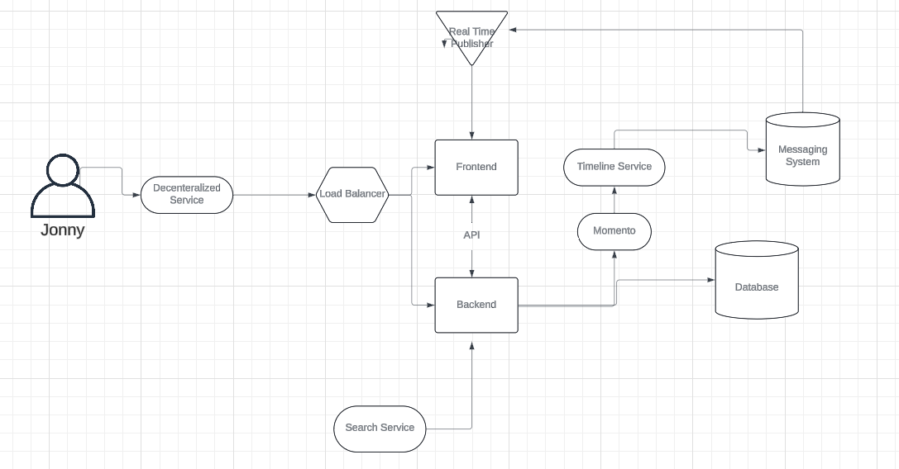

# Week 0 — Billing and Architecture

## Pre-requisites for the AWS project 
⦁	Setting up a Gitpod account 
⦁	Syncing GitHub Account with the GitPod account
⦁	Using the template on GitHub to get the same Repository structure
# Theoretical Tasks
Before doing any practical work, I've documented my theoretical assignments first. 
The things I've studied in theory after watching all the videos from Andrew, Chris, Margaret & Shala.

 

## How to gather functional and non-functional requirements

1. What should be the **scope** of the project means what features and functionalities are we covering in our first MVP
2. What should be the **cost** of our project so that we can measure our budgets and resources we utilize to create the project.
3. In what **time** frame we are creating the project or atleast our first MVP, because time would be the main constraint for stakeholders.

By Calculating all the above points we can measure the quality of our project that we can share with our stakeholders or clients.

Some Notes that can help to design our app solution in a better way.

- Ephemeral-first Micro Blogging Application
- Fractional CTO
- Partly developed app - keep or rebuild
- Monetizing the platfrom
- Frontend - React.js
- Backend - Python  (flask)
- Careful on budget
- Can user upload content?
- User Engagment
- AWS - services, containers, budgets, Infrastructure
- Architecture & ongoing estimate 
- Personas - who can help to create our application

 

## Different types of Achitectures

- TOGAF Architecture
- C4 Model
- AWS wel architected framework & tool

Here's the logical and napkin diagram for cruddr application

⦁	Creating a Lucidchart account for the architecture design

 

GittHub Account journal week 0
Completed tasks for WEEK 0:
Conceptual Design is created
AWS CLI installation
Architecure DIagram for the CI/CD Pipeline is done
Install AWS CLI

⦁	We are going to install the AWS CLI when our Gitpod enviroment lanuches.
⦁	We are  going to set AWS CLI to use partial autoprompt mode to make it easier to debug CLI commands
⦁	Getting Familiar with the drectory structure
⦁	Updating the .gitpod.yml with incuding the following tasks
 
⦁	The commands ran manually to perform the installation
⦁	The bash commands we are using can be reviewed on the AWS Documentation page: https://docs.aws.amazon.com/cli/latest/userguide/getting-started-install.html

### Create a new User and Generate AWS Credentials
⦁	Go to the IAM Users Console for creating a  new User
⦁	Enable console access
⦁	Creating a new Admin group and apply Administrator Access (Not a best practice but okay for our use case)
⦁	Create  an Access Key for the AWS CLI
⦁	Save the credentials 

### Enable Billing
⦁	Billing Alerts are recommended for a better Overview on the monthly payment
⦁	The Root Account is required to for setting up Billing Alerts

### Create a Billing Alarm 
⦁	Required to create a SNS Topic for the Billing Alarm
⦁	SNS is used for getting Notifications in different ways like Mail, SMS etc.
Create an AWS Budget 
Go through the Instructions on the following page: https://docs.aws.amazon.com/cli/latest/reference/budgets/create-budget.html

